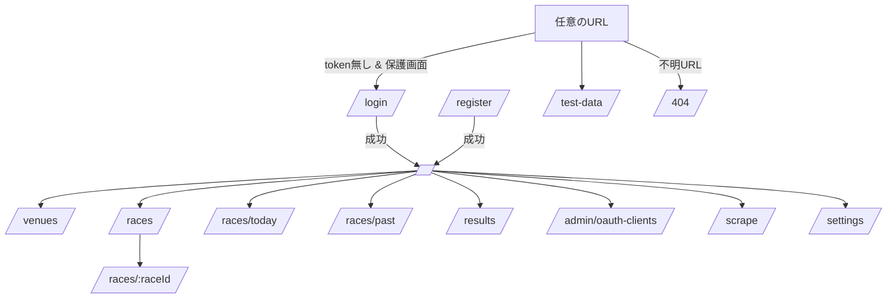

# Frontend Screen Transitions（画面遷移）

作成日: 2026-01-04（Asia/Tokyo）  
更新日: 2026-01-04（Asia/Tokyo）

更新履歴
- 2026-01-04: 初版作成（画面遷移と認証リダイレクト規約を明文化）。

---

## 1. 目的
- frontend の **画面遷移規約**（認証・URL・導線）を固定し、実装/テストの根拠にする。
- 画面の正は `services/frontend/src/router.tsx` とし、本ドキュメントは仕様（意図）を説明する。

## 2. 遷移全体図（概要）

## 3. 認証リダイレクト規約
- **保護画面**へ token 無しで到達した場合、`/login` へ遷移する。
- `/login` へは「遷移元（from）」を保持し、ログイン成功時に from へ戻す。
- 例: `/races` を直打ち → `/login` → ログイン成功 → `/races`

## 4. 主要フロー（ユーザー操作観点）
### 4.1 認証
- `/register` →（ユーザー作成成功）→ `/`
- `/login` →（ログイン成功）→ 遷移元 or `/`

### 4.2 レース参照
- `/races`（検索・一覧）→ 一覧の race をクリック → `/races/:raceId`
- `/races/:raceId` ではタブ切替（summary/entries/odds/results/payouts）で関連データを追加表示する（画面遷移は増やさない）。

### 4.3 管理（OAuth client / service token）
- `/admin/oauth-clients` で client を作成 → secret を表示
- 同画面で `/auth/token` を呼び出し service token を取得（以後、設定で service token を利用可能）

### 4.4 Scrape Console
- `/scrape` で投入系の操作（/scrape/*、スケジュール、同期、手動スクレイプ）をまとめて扱う。
- 画面分割はせず、カード/タブ/折りたたみ等で情報を集約する。

### 4.5 Docs Test Data Viewer（`/test-data`）
- `/test-data` は **API/認証なしで閲覧できる**。
- 一覧（dataset）→クリック→ 詳細（ファイル）→クリック→ Markdown を表示、の **1画面内遷移**で完結する。

