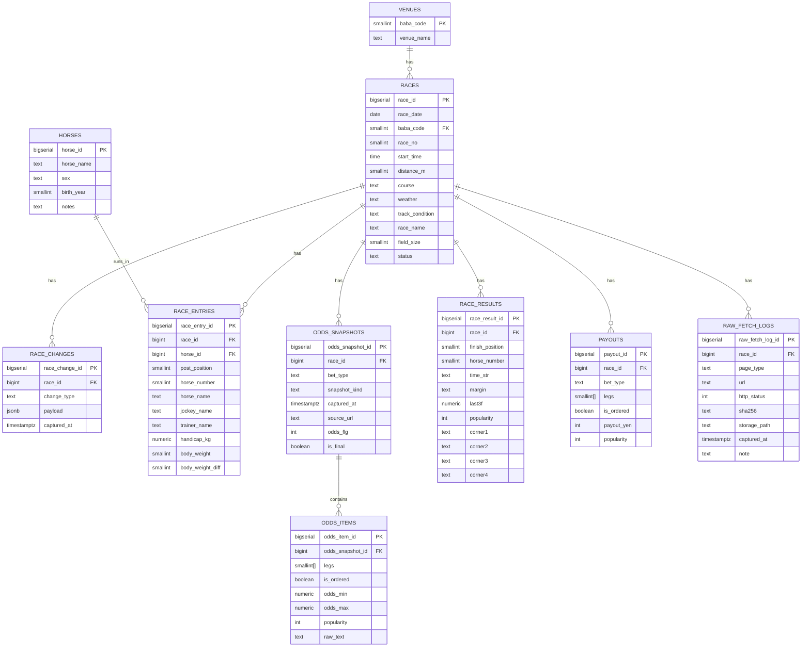

# scraper-service データベース定義

## 1. 設計方針

### 1.1 正規キー

* **レースの一意キー**：`(race_date, baba_code, race_no)`
* すべてのFact（出馬表・オッズ・成績・払戻）は、このレースキーに紐づける

### 1.2 オッズはスナップショット保存

* **発走時刻基準**で `t_minus_60m / t_minus_30m / t_minus_20m / t_minus_10m / t_minus_5m / t_minus_1m / final` を収集し、DBに保存（運用で追加可）
* `odds_flg` は **時刻指定ではなく表示モード**（馬番順/人気順/マトリクス等）として扱う

### 1.3 データ層

* **Fact層（必須）**：学習や集計に使う正規化データ
* **Raw層（任意）**：HTTPステータス、HTML保存先、sha256等（デバッグ・再現性用）

---

## 2. ER図（Mermaid）

---

## 3. 共通ENUM（推奨：CHECK制約 or PostgreSQL ENUM）

### 3.1 bet_type

| 値            | 意味      |
| ------------ | ------- |
| `tanfuku`    | 単勝/複勝   |
| `wakuren`    | 枠連複/枠連単 |
| `umaren`     | 馬連複     |
| `umatan`     | 馬連単     |
| `wide`       | ワイド     |
| `sanrenpuku` | 三連複     |
| `sanrentan`  | 三連単     |

### 3.2 snapshot_kind（発走時刻基準）

| 値            | 意味            |
| ------------ | ------------- |
| `t_minus_60m` | 発走60分前スナップショット |
| `t_minus_30m` | 発走30分前スナップショット |
| `t_minus_20m` | 発走20分前スナップショット |
| `t_minus_10m` | 発走10分前スナップショット |
| `t_minus_5m`  | 発走5分前スナップショット |
| `t_minus_1m`  | 発走1分前スナップショット |
| `final`       | 最終（締切後/確定相当）   |

> 値は運用で拡張可能（本リリースのデフォルトは上記）

---

## 4. テーブル定義（Fact層）

### 4.1 venues（競馬場マスタ）

**目的**：`baba_code` の表示名管理（最低限）

| 列名         |        型 | NULL |  キー | 説明     |
| ---------- | -------: | :--: | :-: | ------ |
| baba_code  | smallint |  NO  |  PK | 競馬場コード |
| venue_name |     text |  NO  |     | 競馬場名   |

**制約・Index**

* PK：`(baba_code)`

---

### 4.2 races（レース）

**目的**：レース条件の中心テーブル

| 列名              |         型 | NULL |   キー  | 説明                              |
| --------------- | --------: | :--: | :---: | ------------------------------- |
| race_id         | bigserial |  NO  |   PK  | 内部ID                            |
| race_date       |      date |  NO  |   UK  | レース日                            |
| baba_code       |  smallint |  NO  | UK/FK | 競馬場コード（venues）                  |
| race_no         |  smallint |  NO  |   UK  | レース番号                           |
| start_time      |      time |  YES |       | 発走時刻                            |
| distance_m      |  smallint |  YES |       | 距離（m）                           |
| course          |      text |  YES |       | 右/左/直線/ダ等（取れる範囲）                |
| weather         |      text |  YES |       | 天候                              |
| track_condition |      text |  YES |       | 馬場                              |
| race_name       |      text |  YES |       | 競走名                             |
| field_size      |  smallint |  YES |       | 頭数                              |
| status          |      text |  YES |       | `scheduled/finished/canceled` 等 |

**制約・Index**

* UNIQUE

  * `uq_races_race_key (race_date, baba_code, race_no)`
* INDEX（推奨）

  * `idx_races_date_venue (race_date, baba_code)`
  * `idx_races_date_time (race_date, start_time)`

---

### 4.3 race_changes（変更情報）

**目的**：出走取消、騎手変更等（RaceList下部の変更テーブル由来）

| 列名             |           型 | NULL |  キー | 説明           |
| -------------- | ----------: | :--: | :-: | ------------ |
| race_change_id |   bigserial |  NO  |  PK | 内部ID         |
| race_id        |      bigint |  NO  |  FK | races        |
| change_type    |        text |  NO  |     | 種別（取消/騎手変更等） |
| payload        |       jsonb |  NO  |     | 原文・抽出結果      |
| captured_at    | timestamptz |  NO  |     | 取得時刻         |

**制約・Index**

* INDEX：`idx_changes_race (race_id)`
* 重複排除が必要なら運用で UNIQUE を追加（payload内容次第）

---

### 4.4 horses（馬マスタ：任意）

**目的**：馬名の正規化（ただし馬の固有ID取得が未確定なので軽量に）

| 列名         |         型 | NULL |  キー | 説明   |
| ---------- | --------: | :--: | :-: | ---- |
| horse_id   | bigserial |  NO  |  PK | 内部ID |
| horse_name |      text |  NO  |     | 馬名   |
| sex        |      text |  YES |     | 性    |
| birth_year |  smallint |  YES |     | 生年   |
| notes      |      text |  YES |     | 備考   |

**制約・Index**

* INDEX：`idx_horses_name (horse_name)`

> 馬の固有コード（公式ID）が取れるなら `horse_code` を追加し UNIQUE 化が望ましい（現時点では不明）

---

### 4.5 race_entries（出走表）

**目的**：出馬表（DebaTable）の出走情報

| 列名               |            型 | NULL |  キー | 説明               |
| ---------------- | -----------: | :--: | :-: | ---------------- |
| race_entry_id    |    bigserial |  NO  |  PK | 内部ID             |
| race_id          |       bigint |  NO  |  FK | races            |
| horse_id         |       bigint |  YES |  FK | horses（任意）       |
| post_position    |     smallint |  YES |     | 枠                |
| horse_number     |     smallint |  NO  |  UK | 馬番（レース内一意）       |
| horse_name       |         text |  NO  |     | 冗長保持（馬テーブル無しでも可） |
| jockey_name      |         text |  YES |     | 騎手               |
| trainer_name     |         text |  YES |     | 調教師              |
| handicap_kg      | numeric(4,1) |  YES |     | 斤量               |
| body_weight      |     smallint |  YES |     | 馬体重              |
| body_weight_diff |     smallint |  YES |     | 増減               |

**制約・Index**

* UNIQUE：`uq_entries_race_horseno (race_id, horse_number)`
* INDEX：`idx_entries_race (race_id)`

---

### 4.6 odds_snapshots（オッズ・スナップショット）

**目的**：発走時刻基準でのオッズ収集の単位

| 列名               |           型 | NULL |  キー | 説明                              |
| ---------------- | ----------: | :--: | :-: | ------------------------------- |
| odds_snapshot_id |   bigserial |  NO  |  PK | 内部ID                            |
| race_id          |      bigint |  NO  |  FK | races                           |
| bet_type         |        text |  NO  |  UK | 式別（ENUM推奨）                      |
| snapshot_kind    |        text |  NO  |  UK | t_minus_60m / t_minus_30m / t_minus_20m / t_minus_10m / t_minus_5m / t_minus_1m / final |
| captured_at      | timestamptz |  NO  |     | 取得時刻                            |
| source_url       |        text |  NO  |     | 取得元URL                          |
| odds_flg         |         int |  YES |     | 表示モード（馬番順/人気順等）                 |
| is_final         |     boolean |  NO  |     | 最終表記だったか                        |

**制約・Index**

* UNIQUE：`uq_odds_snapshot (race_id, bet_type, snapshot_kind, odds_flg)`
  * odds_flg は NULL 可だが一意キーに含める
* INDEX：`idx_odds_snap_race (race_id)`

---

### 4.7 odds_items（オッズ明細）

**目的**：スナップショット内の各組合せ

| 列名               |             型 | NULL |  キー | 説明              |
| ---------------- | ------------: | :--: | :-: | --------------- |
| odds_item_id     |     bigserial |  NO  |  PK | 内部ID            |
| odds_snapshot_id |        bigint |  NO  |  FK | odds_snapshots  |
| legs             |    smallint[] |  NO  |     | 組合せ（例：[3,7,1]）  |
| is_ordered       |       boolean |  NO  |     | 順序式別か（馬単/三連単など） |
| odds_min         | numeric(10,3) |  NO  |     | オッズ下限           |
| odds_max         | numeric(10,3) |  YES |     | 上限（ワイドレンジ対応）    |
| popularity       |           int |  YES |     | 人気              |
| raw_text         |          text |  YES |     | 元表記（レンジ等の保険）    |

**制約・Index**

* UNIQUE（推奨）：`uq_odds_item (odds_snapshot_id, legs, is_ordered)`
* INDEX：`idx_odds_items_snap (odds_snapshot_id)`
* `legs` 検索を多用するなら GIN も検討

---

### 4.8 race_results（成績）

**目的**：RaceMarkTableの確定成績

| 列名              |            型 | NULL |  キー | 説明         |
| --------------- | -----------: | :--: | :-: | ---------- |
| race_result_id  |    bigserial |  NO  |  PK | 内部ID       |
| race_id         |       bigint |  NO  |  FK | races      |
| finish_position |     smallint |  NO  |     | 着順         |
| horse_number    |     smallint |  NO  |     | 馬番         |
| time_str        |         text |  YES |     | タイム（文字列保持） |
| margin          |         text |  YES |     | 着差         |
| last3f          | numeric(4,1) |  YES |     | 上り3F       |
| popularity      |          int |  YES |     | 人気         |
| corner1         |         text |  YES |     | 1角         |
| corner2         |         text |  YES |     | 2角         |
| corner3         |         text |  YES |     | 3角         |
| corner4         |         text |  YES |     | 4角         |

**制約・Index**

* UNIQUE（推奨）

  * `uq_results_race_pos (race_id, finish_position)`
  * `uq_results_race_horseno (race_id, horse_number)`
* INDEX：`idx_results_race (race_id)`

---

### 4.9 payouts（払戻）

**目的**：RefundMoneyListの式別払戻

| 列名         |          型 | NULL |  キー | 説明    |
| ---------- | ---------: | :--: | :-: | ----- |
| payout_id  |  bigserial |  NO  |  PK | 内部ID  |
| race_id    |     bigint |  NO  |  FK | races |
| bet_type   |       text |  NO  |     | 式別    |
| legs       | smallint[] |  NO  |     | 組合せ   |
| is_ordered |    boolean |  NO  |     | 順序式別か |
| payout_yen |        int |  NO  |     | 払戻金   |
| popularity |        int |  YES |     | 人気    |

**制約・Index**

* UNIQUE（推奨）：`uq_payout (race_id, bet_type, legs, is_ordered)`
* INDEX：`idx_payout_race (race_id)`

---

## 5. テーブル定義（Raw層：任意）

### 5.1 raw_fetch_logs（取得ログ）

**目的**：取得失敗やHTML差分検知の根拠を残す（運用・監視用）

| 列名               |           型 | NULL |  キー | 説明                               |
| ---------------- | ----------: | :--: | :-: | -------------------------------- |
| raw_fetch_log_id |   bigserial |  NO  |  PK | 内部ID                             |
| race_id          |      bigint |  YES |  FK | races（race_no未確定ならNULL可）         |
| page_type        |        text |  NO  |     | RaceList/DebaTable/OddsTanFuku 等 |
| url              |        text |  NO  |     | 取得URL                            |
| http_status      |         int |  NO  |     | HTTPステータス                        |
| sha256           |        text |  YES |     | 本文ハッシュ                           |
| storage_path     |        text |  YES |     | HTML保存先                          |
| captured_at       | timestamptz |  NO  |     | 取得時刻                             |
| note             |        text |  YES |     | 例外やエラー文言                         |

---

## 6. Upsert（冪等）キーまとめ

| 対象             | Upsertキー                                                 |
| -------------- | -------------------------------------------------------- |
| races          | `(race_date, baba_code, race_no)`                        |
| race_entries   | `(race_id, horse_number)`                                |
| odds_snapshots | `(race_id, bet_type, snapshot_kind, odds_flg)`            |
| odds_items     | `(odds_snapshot_id, legs, is_ordered)`                   |
| race_results   | `(race_id, finish_position)` と `(race_id, horse_number)` |
| payouts        | `(race_id, bet_type, legs, is_ordered)`                  |
