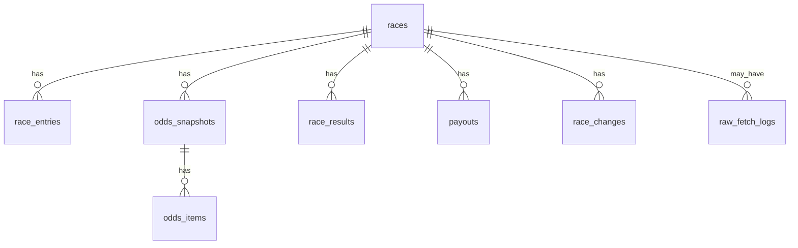

# 02 データベース設計（ER図＋定義方針）

作成日: 2025-12-27（Asia/Tokyo）

---

## 1. 設計のゴール

- **学習（予測/強化学習）に必要な事実データを、冪等に蓄積**できる
- 代表オッズ（t_minus_60m / t_minus_30m / t_minus_20m / t_minus_10m / t_minus_5m / t_minus_1m / final 等）を **同一 race_key** に時系列で保持できる
- スクレイピング失敗や HTML 差分を追跡できるように、必要に応じて **Raw層**（HTML/HTTPログ）も持てる

> 本書は方針ドキュメント（概念設計）。具体DDLは `docs/database/25_database_definition.md` を正とする。

---

## 2. レースキー（共通キー）

- `race_key = (race_date, baba_code, race_no)`
- すべてのテーブルは最終的に `race_id`（racesのPK）へ紐づける

---

## 3. ER図（最小）

---

## 4. bet_type（共通の列挙）

### 4.1 Odds*（7ページ由来）
- `tansho`（単勝）
- `fukusho`（複勝）
- `wakuren`（枠連複）
- `wakutan`（枠連単）
- `umaren`（馬連複）
- `umatan`（馬連単）
- `wide`（ワイド）
- `sanrenpuku`（三連複）
- `sanrentan`（三連単）

> 注意: 「7ページ」= 7 URL だが、単複・枠連ページは **複数 bet_type** を含む。

### 4.2 bet_type と legs の解釈
- `tansho/fukusho/umaren/umatan/wide/sanrenpuku/sanrentan` の legs は **馬番**
- `wakuren/wakutan` の legs は **枠番**
- `is_ordered` は、順序式別（umatan/wakutan/sanrentan）で true、それ以外は false

---

## 5. テーブル定義方針（最小）

### 5.1 races
- UNIQUE: `(race_date, baba_code, race_no)`
- 取得元: RaceList / DebaTable / RaceMarkTable / Odds*（冗長情報を統合）

### 5.2 race_entries（出走表）
- UNIQUE: `(race_id, horse_number)`（レース内で馬番は一意）
- 取得元: DebaTable（主）/ RaceMarkTable（従: 馬体重など確定値の上書き）
- horse_id の正規化は **公式IDの取得可否が未確定**のため後回し（当面は horse_name を冗長保持）

### 5.3 odds_snapshots / odds_items（時系列オッズ）
- odds_snapshots UNIQUE: `(race_id, bet_type, snapshot_kind, odds_flg)`
  - snapshot_kind 例: `t_minus_60m`, `t_minus_30m`, `t_minus_20m`, `t_minus_10m`, `t_minus_5m`, `t_minus_1m`, `final` など（運用で追加可）
  - odds_flg は表示モード識別子（NULL 可）。NULL も一意キーに含める
- odds_items UNIQUE: `(odds_snapshot_id, legs, is_ordered)`
- レンジ表現（ワイド/複勝等）は `odds_min/odds_max` で統一
  - 単値は `odds_min = odds_max`
  - 欠損は両方 NULL（`05_parsing_fixture_tdd.md` の A3）

### 5.4 race_results（成績）
- 取得元: RaceMarkTable
- 着順・タイム・人気などを保存し、ラップ/通過順は文字列で保持→後で特徴量化
- UNIQUE は `(race_id, finish_position)` と `(race_id, horse_number)` を併用すると安全

### 5.5 payouts（払戻）
- 取得元: RefundMoneyList（主）/ RaceMarkTable（従）
- UNIQUE: `(race_id, bet_type, legs, is_ordered)`
- `payout_yen` は整数（円）
- `popularity` は存在しない式別/ケースがあるため NULL 許容
- 返還等が出る場合は、将来拡張として `status`（`normal/refund/void` 等）を追加する余地あり（現時点は未確認のため「わからない」）

### 5.6 race_changes（出走取消・騎手変更など）
- 取得元: RaceList（下部の変更情報テーブル）
- 目的: 変更イベントを事後検証・特徴量化できるように保持
- UNIQUE（推奨）: `(race_id, change_type, horse_number, announced_at)` など（詳細は `docs/database/25_database_definition.md`）

### 5.7 raw_fetch_logs（Raw層: 取得監査）
- 永続データに含める（任意）（必要になった段階で追加）
- 保存対象（推奨）: `url, page_type, http_status, captured_at, sha256, out_path(任意), elapsed_ms(任意)`
- 目的: HTML差分/障害再現/アクセス監査（必要時のみ）

---

## 6. 一意制約（まとめ）

|テーブル|UNIQUE|
|---|---|
|races|`(race_date, baba_code, race_no)`|
|race_entries|`(race_id, horse_number)`|
|odds_snapshots|`(race_id, bet_type, snapshot_kind, odds_flg)`|
|odds_items|`(odds_snapshot_id, legs, is_ordered)`|
|race_results|`(race_id, finish_position)` および `(race_id, horse_number)`|
|payouts|`(race_id, bet_type, legs, is_ordered)`|

---

## 7. 未確認・今後の拡張

- 公式の馬ID（horse_code）を取得できる場合は `horses` を強化して正規化
- CompeteTable（対戦表）は「過去レースが可変列」なので、保存する場合は縦持ち（horse × past_race）で別テーブル化
- Raw層（url/http_status/sha256/html）を持つ場合、HTML差分やバグ再現が容易になる

---

## 8. 反映フロー（推奨: 冪等ETL順序）

`race_key` を基準に、以下の順で upsert する（B4で確定）。

1. `RaceList(date,baba_code)` → `races`（発走時刻） + `race_changes`
2. `DebaTable(race_key)` → `race_entries` + `races`（距離/条件など補完）
3. `Odds*(race_key, snapshot_kind, odds_flg)` → `odds_snapshots` + `odds_items`
4. `RaceMarkTable(race_key)` → `race_results` + `races`/`race_entries`（確定値で上書き）
5. `RefundMoneyList(date,baba_code)` → `payouts`

データソース優先順位（衝突時の推奨）
- `races.start_time`: RaceList を優先（スケジューラの一次情報）
- `race_entries.body_weight/body_weight_diff`: RaceMarkTable を優先（確定値）
- 天候/馬場: RaceMarkTable（確定後）で上書き可
- 払戻: RefundMoneyList を優先

---

## 8. C1（PostgreSQL 初期実装）— 設計として確定

### 8.1 運用前提（決めること）

- DBは **PostgreSQL** を前提とする（docker composeで運用）
- マイグレーションは **SQLファイルの連番適用**で統一する  
  - 理由: 依存を増やさず、scraper-service / backend / ai のいずれからも同一手順で適用できるため

> 推測ですが：将来的に ORM（SQLAlchemy等）を導入する場合でも、初期はSQLマイグレーションの方が差分レビューが容易です。  
> ただし、ORM導入の有無は本資料では確定しません（プロジェクト判断）。

### 8.2 マイグレーション構成（提案）

- `db/migrations/sql/`
  - `0001_init.sql`（本スキーマの初期作成）
  - `0002_add_indexes.sql`（必要なら分割）
  - `0003_add_columns_*.sql`（フィクスチャ確定後の拡張）

- 適用管理（DB側）
  - `schema_migrations(version text primary key, applied_at timestamptz not null default now())`

### 8.3 初期DDLの正

- 物理DDLは `docs/database/25_database_definition.md` の **PostgreSQL DDL** を正とする。

### 8.4 初期投入（最小）

- `venues` は `baba_code` の出現を見て **後追い投入**でも可（NULL許容はしない設計のため、投入は必要）
- それ以外は scraper の upsert により蓄積する

### 8.5 監査・運用ログ（任意）

- `raw_fetch_logs` は必要時のみ記録（成功/失敗を問わない）
- HTMLの保存先（ファイルパス）は必要に応じて `raw_fetch_logs.storage_path` に保存する

参照: `source_shared/29_db_migration_and_bootstrap.md`
